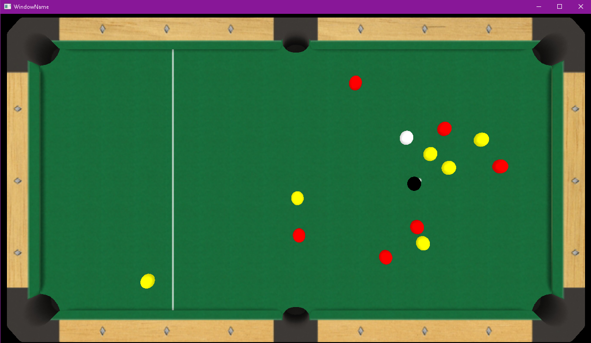
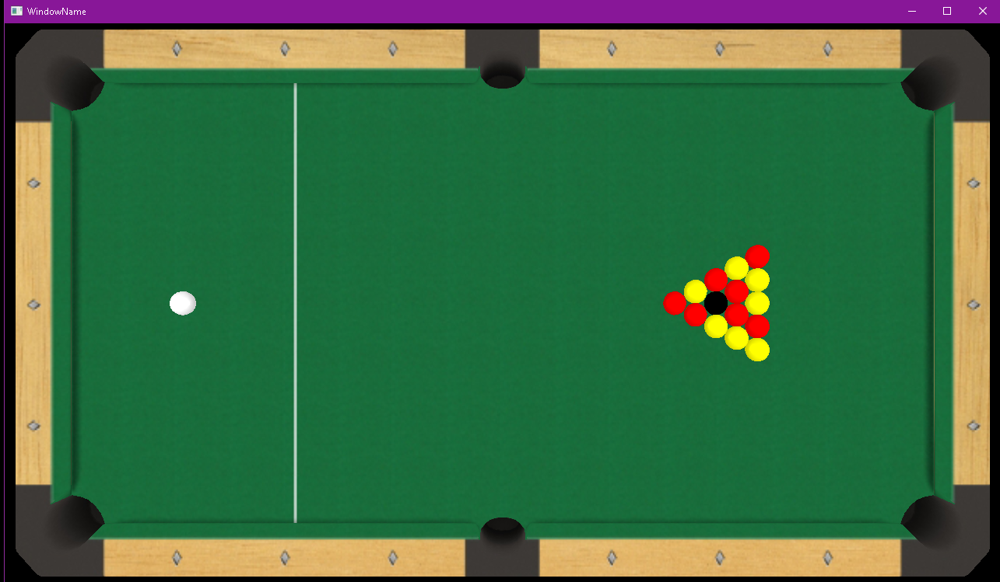
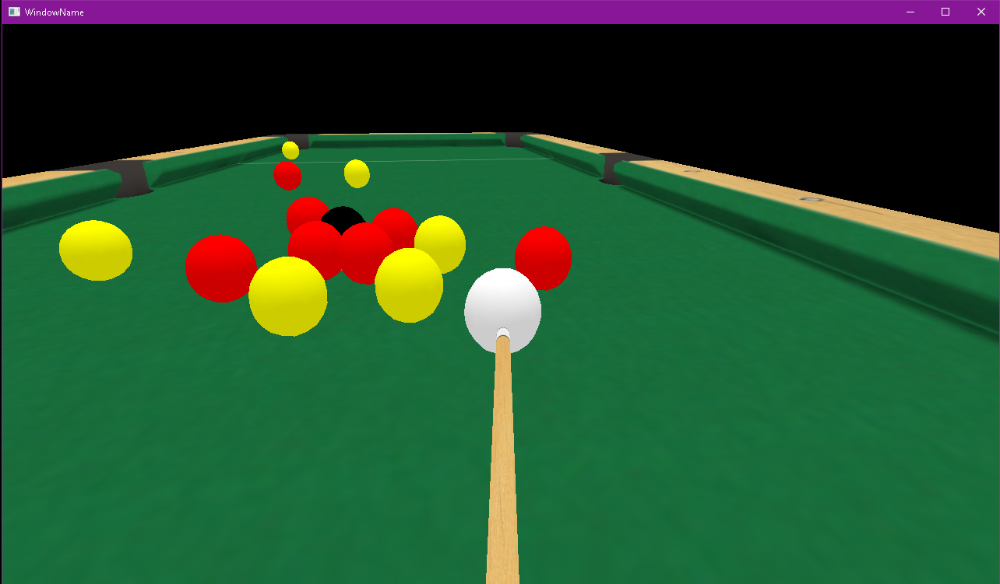

### Description: ###
Classic pool game implemented in C++ using OpenGL.

The game can be played by 2 players. First player places the white ball in the first third of the table using WASD then uses SPACE to confirm. A third person view of the ball will be shown. The player can move the camera around by holding RMB and moving the mouse. Why holding LMB, the cue will start moving, and, when releasing the mouse button, a force proportionate with the distance between the cue and ball will be applied to the ball.

The table has 7 red balls, 7 yellow balls and a black ball. The colours will be assigned based on the colour of the first pocketed ball. The players will have to pocket all balls which have the same colour as their assigned colour and, in the end, the black ball. The game will end when the black ball is pocketed.

Information about which colour is assigned to each player, remaining balls to be pocketet, if last player's move was a fault are displayed in the terminal.

### Screenshots: ###

### References: ###
#### 3D Models: ####
https://free3d.com/3d-model/pool-table-v1--600461.html \
https://free3d.com/3d-model/pool-cue-v1--229730.html

#### Collision algorithm: ####
http://www.gamasutra.com/view/feature/3015/pool_hall_lessons_fast_accurate_.php
